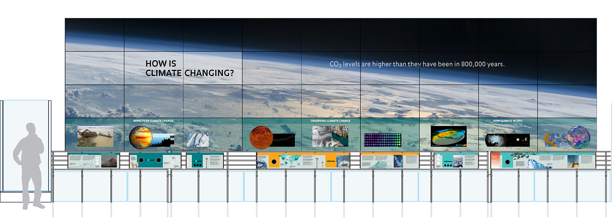

## Design and development

The design and development of the Climate Wall will be done **collaboratively, iteratively, and transparently**. This site should help facilitate this.

### The Climate Wall format

- 36 high definition screens laid out in a nine-by-four grid
- Each screen is four feet in width with a 16:9 aspect ratio, 1080p
- The bottom row (9 screens) will be situated to be viewed at eye level
- The bottom 9 screens will contain a mix of interactive (4-6 screens) and rendered (3-5 screens) content
- Label decks will be situated below the bottom row of screens and will contain written and visual content to support the screen content
- The interactive content will be controlled by physical inputs embedded in the decks
- Content in the top 27 screens will contain "meta messages" and their supporting visuals
- Some screens may have sound

### Design and development strategy

In general, there are two categories of work around the design and development of the Climate Wall:

1. The design of **each discrete screen and label deck** (each of the 9 bottom screens, the label decks, and the meta content)
   - Each section should be able to stand on its own without requiring a prerequisite section (i.e. order doesn't matter)
   - A clear message/lesson should be delivered for each section
2. The design of the **Climate Wall as a whole** which includes:
   - Content hierarchy and organization (e.g. titles, groups)
   - A coherent visual language
   - A style guide (colors, fonts, spacing, etc.)
   - Cohesive and balanced visual and audio elements (e.g. a mix of globes, charts, diagrams, sounds that are diverse yet complementary)
   - A cohesive experience design (e.g. interactions and messaging are consistent throughout, relationships between screens are clear and intuitive)

For the work in Section 1 (each discrete screen), the design and development will primarily be driven by building functional prototypes. The goal would be to create working interactives and visualizations that can be tested directly with internal and external users. You can find find the [prototypes here](https://beefoo.github.io/climate-lab/), and can learn more about [user research here](../research/README.html).

The work in Section 2 (the holistic design), the design and development will primarily be sketches, mock-ups, and documents since it is not feasible to prototype the entire wall in the early stages of development. You can find this content in the [Sketches and Mock-ups](sketches.html) section.
