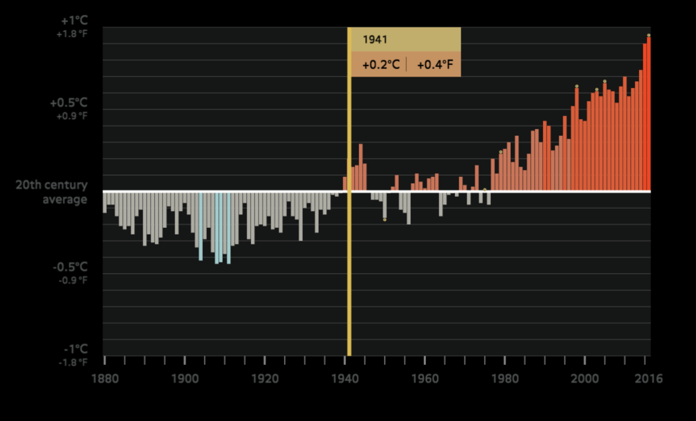
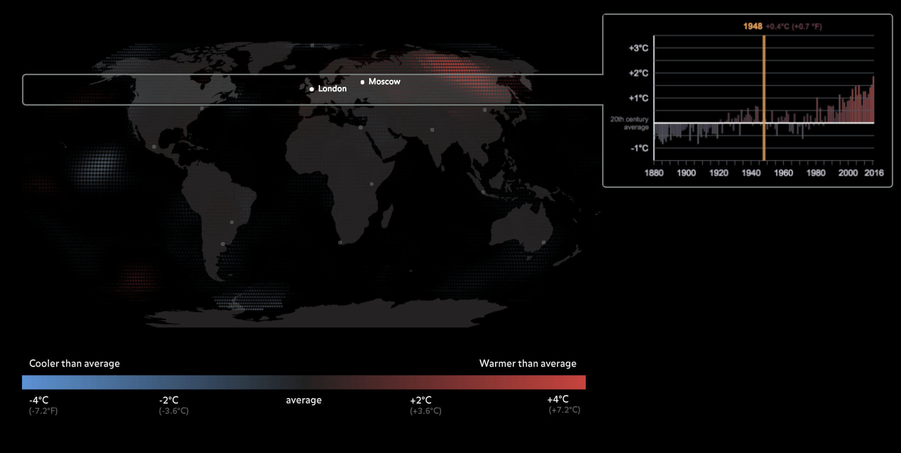
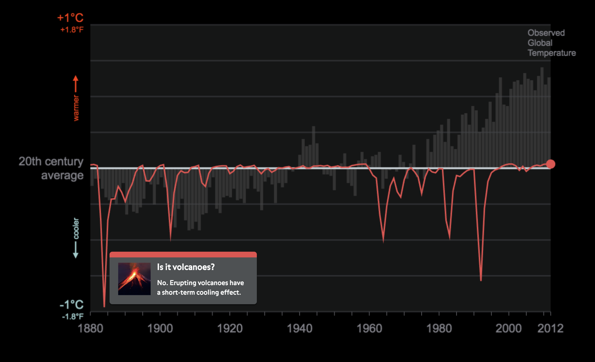
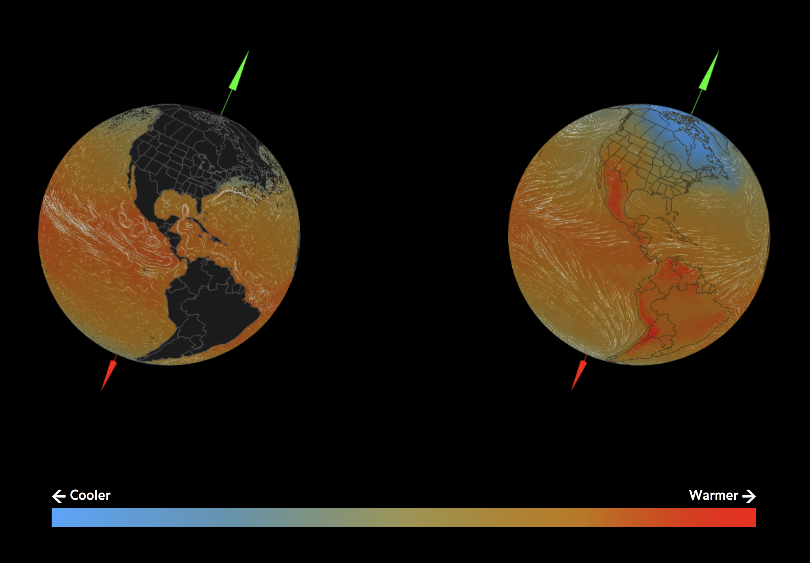

# Data sources of media interactives

## Warming World: What can we say about global temperature at different timescales?

- [Global Land and Ocean Temperature Anomalies](https://www.ncdc.noaa.gov/cag/global/time-series/globe/land_ocean/p12/12/1880-2018.csv)
- Source: [NOAA NCDC](https://www.ncdc.noaa.gov/monitoring-references/faq/anomalies.php) (click "Anomalies and Index Data")
- Temporal coverage: 1880 - present
- Temporal resolution: monthly and annual
- Geographic coverage/resolution: global
- Baseline: 20th century average (1901-2000)

## Warming World: Where is climate change most dramatic?

- [Land-Ocean Temperature Index, ERSSTv5, 1200km smoothing](https://data.giss.nasa.gov/gistemp/) (Compressed NetCDF files)
- Source: [NASA GISS](https://data.giss.nasa.gov/gistemp/)
- Temporal coverage: 1880 - present
- Temporal resolution: monthly
- Geographic coverage: global
- Geographic resolution: 2° lon/lat
- Baseline: 1951-1980 mean

## Warming World: What's warming the planet?

- [CMIP5 GISS-E2 Global Radiative Forcings (Fi) Miller et al (2014)](https://data.giss.nasa.gov/modelforce/Fi_Miller_et_al14_upd.txt)
- Source: [NASA GISS](https://data.giss.nasa.gov/modelforce/)
- Temporal coverage: 1851 - 2012
- Temporal resolution: annual
- Geographic coverage/resolution: global

## How Climate Works: How is climate driven by energy from the Sun?

### Ocean data

- [OSCAR third degree resolution ocean surface currents](https://podaac.jpl.nasa.gov/dataset/OSCAR_L4_OC_third-deg) (Compressed NetCDF files)
- Source: [NASA JPL PODACC](https://podaac.jpl.nasa.gov/dataset/OSCAR_L4_OC_third-deg)
- Temporal coverage: 1992 - present
- Temporal resolution: 5 days (120 hours)
- Geographic coverage: 66° to -66° lat
- Geographic resolution: 0.33° lon/lat

This is combined with sea surface temperature:

- [Sea surface temperature (AQUA/MODIS)](https://neo.sci.gsfc.nasa.gov/view.php?datasetId=MYD28M) (CSV files)
- Source: [NASA Earth Observations, GSFC](https://neo.sci.gsfc.nasa.gov/)
- Temporal coverage: 2002 - present
- Temporal resolution: 8 days or 1 month
- Geographic coverage: Global
- Geographic resolution: 0.1° lon/lat

### Atmosphere data

- [GFS Analysis](https://nomads.ncdc.noaa.gov/data/gfsanl/) - gives both wind vector data (in meters/second) and absolute temperature in degrees Kelvin (GRIB2 files)
- Source: [NOAA NCDC - Global Forecast System](https://www.ncdc.noaa.gov/data-access/model-data/model-datasets/global-forcast-system-gfs)
- Temporal coverage: 2004 - present
- Temporal resolution: 6 hours
- Geographic coverage: global
- Geographic resolution: 0.5° lon/lat

## Ice core

[Data on this page](ice_core_data.html)
