# HoPE photos

## Before renovation

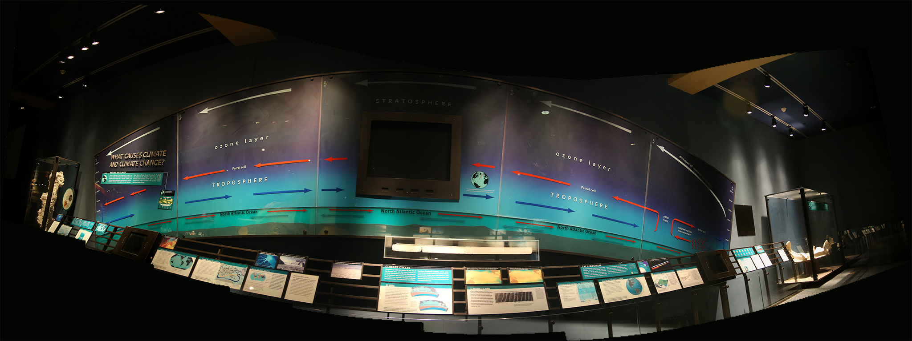
Climate wall panorama

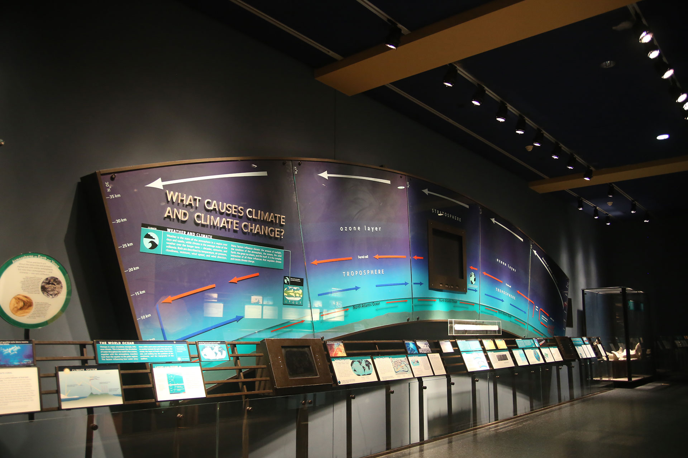
Climate wall. Also, see an [before and after](https://beefoo.github.io/climate-wall-docs/before_after.html).

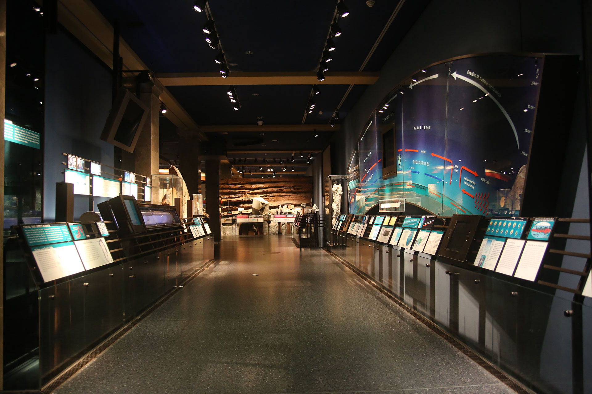
View of the corridor

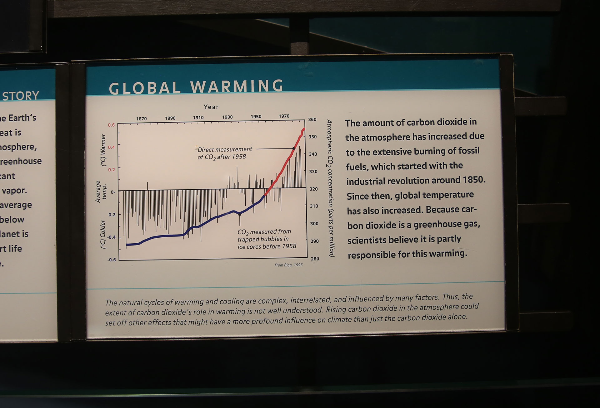
Graph of global warming. Ends ~1996.

## In progress

Early elevation model

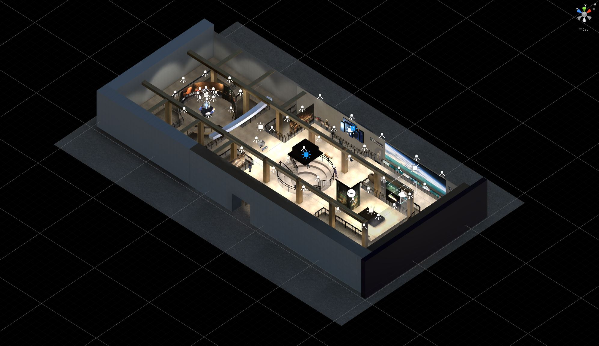
Digital model aerial view

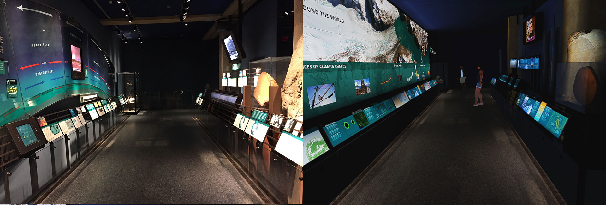
VR side-by-side comparison

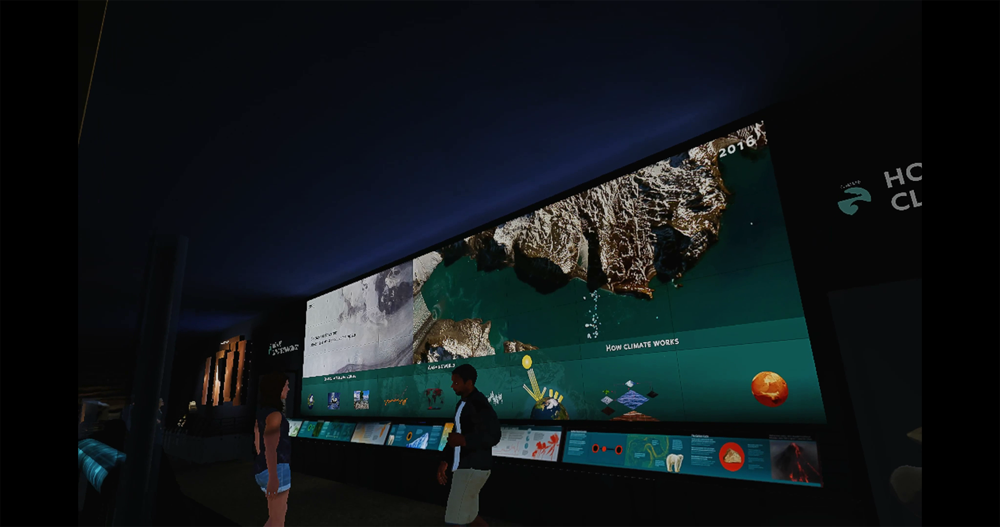
VR scene

<video src="https://s3.amazonaws.com/brianfoo-amnh/video/hope_vr_stereo.mp4" muted autoplay loop></video>
VR stereo walkthrough

<video src="https://s3.amazonaws.com/brianfoo-amnh/video/hope_vr_walkthrough.mp4" muted autoplay loop></video>
VR walkthrough

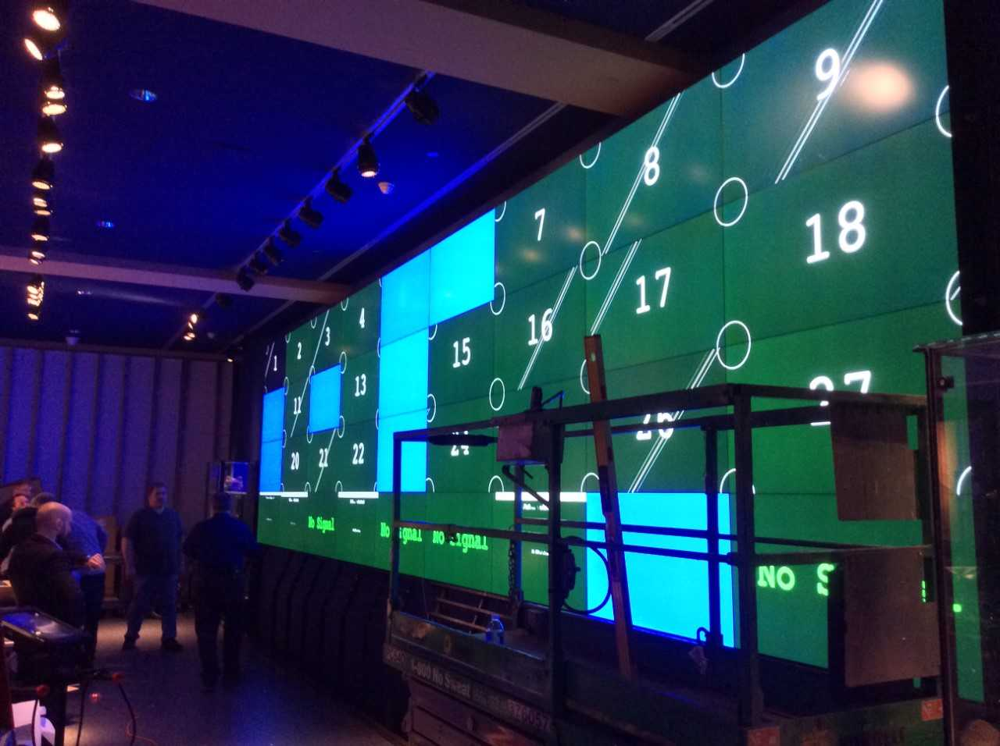
Installation of screens

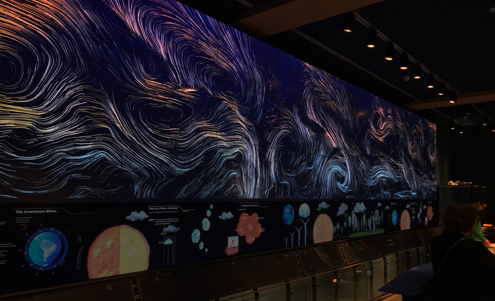
Meta message aesthetic test using wind data and misc graphics

## After renovation

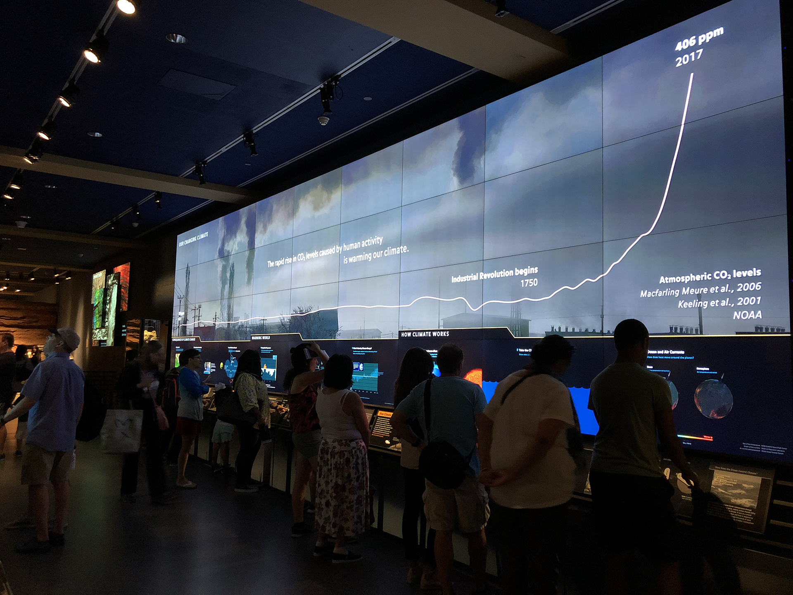
Visitors interacting with screens with CO2 graph above

<video src="https://s3.amazonaws.com/brianfoo.com/assets/amnh_climate_wall/climate_wall_video.mp4" muted autoplay loop></video>
Hurricane season visualization

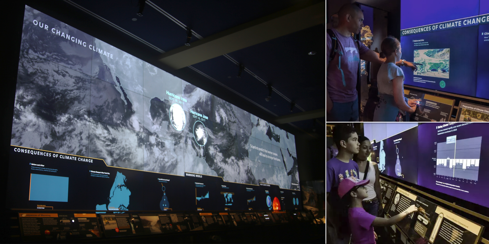
Visitors interacting with screens with hurricane visualization on the left
