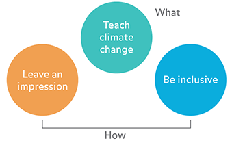
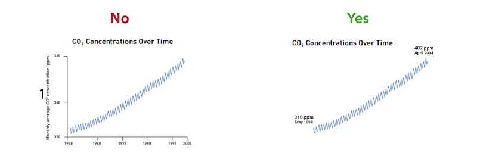
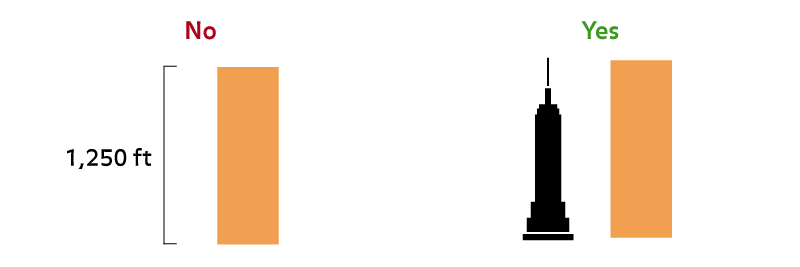

## Design goals, principles, and language

This page will speak to the goals and principles that will inform all design decisions for the HoPE Climate Wall.

### Goals

1. **Teach climate change** - specific lessons and messages about climate and climate change should be delivered by viewing and interacting with the Climate Wall. In particular:
    - Climate change is happening
    - Human activity is the primary driver of climate change, in particular the burning of fossil fuels
    - Climate change has and will have significant human impacts
2. **Leave an impression** - the experience of viewing and interacting with the Climate Wall should be memorable, fun, and exciting
3. **Be [inclusive](https://www.ncsu.edu/ncsu/design/cud/about_ud/udprinciplestext.htm)** - the experience should be accessible by a broad and diverse audience without special adaptation to specific needs. This can be accomplished through being:
    - **Simple and intuitive** - easy to understand regardless of knowledge, cognitive abilities, language skills, or focus levels
    - **Perceptible** - information is communicated regardless of ambient conditions or sensory abilities

The primary function of the wall is to teach climate change (Goal 1.) Goals (2) and (3) is more about the "how." Usually, the better Goals (2) and (3) are executed, the better Goal (1) is fulfilled.

### Design principles

This section will set forth a general design strategy for representing content on the Climate Wall. Examples for good and bad implementations are given using existing media.

1. **Clear and bold, graphic by default** - Graphic over illustrative or photographic where possible, intentional use of color, type, and space
2. **Say more with less** - Eliminate unnecessary design elements, reduce complexity, give emphasis to essential design elements
   
3. **Leverage metaphors** - Use familiar concepts and cues to create intuitive experiences
   
4. **Use motion and sound sparingly and intentionally** - Motion and sound should convey and reinforce meaning, leave an impression

### Visual language

The following section will speak broadly to how we will communicate certain ideas using visuals.

### Interaction design

This section will primarily speak to the physical controls that drive the interactive displays, and how we will use specific types of interactions to communicate specific ideas.

### Sound design

This section will speak to the use of sound on the Climate Wall

### Design inspirations

Based on the design principles outlined above, here are some examples of them done well.
