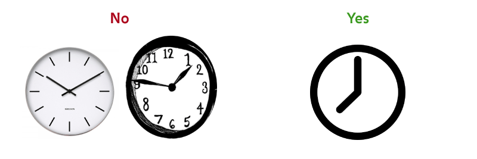

## Design goals, principles, and language

This page will speak to the goals and principles that will inform all design decisions for the HoPE Climate Wall.

### Goals

1. **Teach climate change** - specific lessons and messages about climate and climate change should be delivered by viewing and interacting with the Climate Wall. In particular:
    - Climate is a complex system
    - Climate change is happening
    - Human activity is the primary driver of climate change, in particular the burning of fossil fuels
    - Climate change has and will have significant human impacts
2. **Leave an impression** - the experience of viewing and interacting with the Climate Wall should be memorable, fun, and exciting
    - Give visitors an _aha!_ moment
3. **Be inclusive** - the experience should be [universally](https://www.ncsu.edu/ncsu/design/cud/about_ud/udprinciplestext.htm) accessible by a broad and diverse audience without special adaptation to specific needs. This can be accomplished through being:
    - **Simple and intuitive** - easy to understand regardless of knowledge, cognitive abilities, language skills, or focus levels
    - **Perceptible** - information is communicated regardless of ambient conditions or sensory abilities

The primary function of the wall is to teach climate change (Goal 1.) Goals (2) and (3) is more about the "how." Usually, the better Goals (2) and (3) are executed, the better Goal (1) is fulfilled, i.e. all three goals are complementary.

### Design principles

This section will set forth a general design strategy for representing content on the Climate Wall. Examples for good and bad implementations are given using existing media.

1. **Clear and bold, graphic by default** - Graphic over illustrative or photographic where possible, intentional use of color, type, and space
   
2. **Say more with less** - Eliminate unnecessary design elements, reduce complexity, give emphasis to essential design elements
   
3. **Leverage metaphors** - Use familiar concepts and cues to create intuitive experiences
   
4. **Use motion and sound sparingly and intentionally** - Motion and sound should convey and reinforce meaning, leave an impression

   | No | Yes |
   |---|---|
   |  |  |

### Design language

The following section will speak broadly to how we will communicate certain ideas using visuals, text, interaction, motion, and sound.
