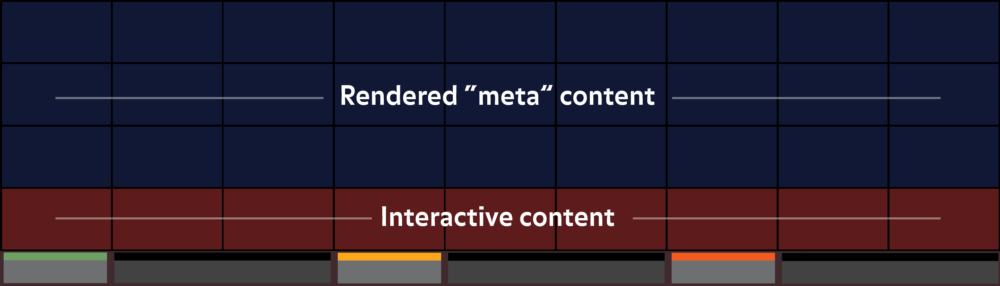
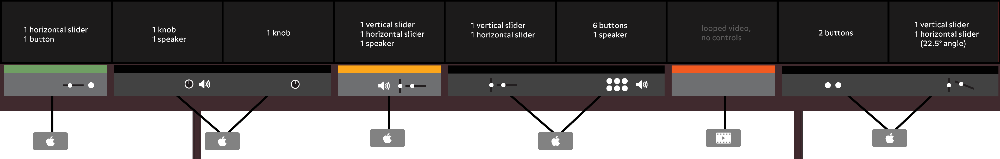

## Technical considerations

This page will give an overview of technical concerns relating to the Climate Wall to facilitate conversations about costs and technical feasibility. This page does not focus on design concerns.

### Screens

- 36 high definition screens laid out in a nine-by-four grid
- Each screen is four feet in width with a 16:9 aspect ratio, 1080p
- The bottom 9 screens will contain interactive content
- The meta content will be visible in the top 27 screens
    - ~~Possibly visible as a subtle background in the bottom 9 screens~~ _removed from requirements_
    - Will only contain rendered content
    - Likely will contain satellite imagery, CG, or graphics (i.e. not filmed content)
- ~~Content in the bottom row _may_ bleed into the row above when appropriate~~ _design constraints modified to following:_
    - Content in bottom row _may_ bleed laterally between two screens, which will be controlled by the same machine (i.e. like an extended desktop)
    - Static and solid content (e.g. section titles) may exist in the meta area but cannot interact with the bottom row, and should animate subtly to reduce burning of screens
- ~~Each of the 9 bottom screens and the meta content are independent from each other~~ _content may be shared laterally between two screens_
- ~~However, there has been discussion about having interactions in the bottom screens sometimes affect content on the big screen, but nothing has been concretely proposed yet~~ _not happening_

### Computers, inputs (controls), and outputs (A/V)

Please refer to the [control specification document](../assets/docs/HoPE_wall_control_specifications_2018-04-03.pdf) for more details.

- The 9 interactive screens will be controlled by 6 computers, 3 of which will have dual-headed output to two screens.
- 5 of the 6 computers will be Mac Minis, the 6th machine will just be looping video
- 5 of the 6 computers will require USB inputs with one or more of the following:
    - horizontal slider
    - vertical slider
    - knob
    - button
- There is one computer that has more than 4 inputs (the one with 6 buttons) and thus will require a USB hub
- 3 of the 6 computers will require audio output and speakers

### Software

The interactives running on Mac Minis are running web apps compiled as [Electron desktop apps](https://electronjs.org/).

### Hardware

- [Spinners](https://www.ultimarc.com/SpinTrak.html)
- [Sliders v1](http://www.potentiometers.com/PTF.cfm?link=SL) and [sliders v2](https://www.cw-industrialgroup.com/Products/Faders/Linear-Manual-Fader-PGF3000)
- [Buttons](https://na.suzohapp.com/products/pushbuttons/D54-0004-21)
- [I-PAC Ultimate I/O](https://www.ultimarc.com/ipacuio.html) for buttons and spinners
- [A-PAC](https://www.ultimarc.com/a-pac.html) for sliders (joystick)

### Layout/wiring diagrams

- Mac 1
   - [Layout](https://docs.google.com/drawings/d/1xrNUxVaL-AKLlfcvBmJv0YKAArj111jfBkhoQTcSuAo/edit?usp=sharing)
   - [Button wiring](https://docs.google.com/drawings/d/1PC8Bcl2f0Adp2HA0k0E3IunbTKDJFCQKJ-dLsh4tnYo/edit?usp=sharing)
   - [Slider wiring](https://docs.google.com/drawings/d/1FnnhbmOsjnr-h_wtfVVchhs-A6nPkp_f_ypofu77XAM/edit)
- Mac 2
   - [Layout](https://docs.google.com/drawings/d/1CsvThGU4NrDKadkb0RH2CjGMkMBVzKtI1LvKPHvSpTU/edit?usp=sharing)
   - [Spinner wiring](https://docs.google.com/drawings/d/1Qz_KTMl_u8It8isdvPm8WmJeg3e63sWrlObwxsq_WwQ/edit?usp=sharing)
- Mac 3
   - [Layout](https://docs.google.com/drawings/d/1XcRkPQi7io-q8m7MxtstI98tH0I951l7XhkLu5AaQLY/edit?usp=sharing)
   - [Slider wiring](https://docs.google.com/drawings/d/1AzIW9DEK-j0OtD7s5-5ND27FRH97KMAaKe1Ry4mDRwo/edit?usp=sharing)
- Mac 4
   - [Layout](https://docs.google.com/drawings/d/113ywMG7vvPpEOOAgxiCGkRG5uZwMusJ80F0cx1vXCNY/edit?usp=sharing)
   - [Button wiring](https://docs.google.com/drawings/d/1RGU7TxYnp0Pgr7SmoPc_Rda2SuOvBtaHSZY5MhCsrA0/edit?usp=sharing)
   - [Slider wiring](https://docs.google.com/drawings/d/1gs57smnOjurAEXWwnHbbpZn9m1imgYT8wUv5xd6Mg3A/edit)
- Mac 5
   - [Layout](https://docs.google.com/drawings/d/14id2uQuMl3yH5q6-mwhE-bSNHVF5sWrTEjbwjnwfb_Y/edit?usp=sharing)
   - [Button wiring](https://docs.google.com/drawings/d/1ZTeckscw--AJDrCEtGGWzT5_aeYRa1lm2VyPB5MCdvc/edit?usp=sharing)
   - [Slider wiring](https://docs.google.com/drawings/d/13qG-Pni41NFGXcxe158ZqPehofrX2da7sJMvkNDeH-M/edit)

### Content update-ability

- Some screens on the bottom row will have data associated with them (e.g. temperature, CO2) that would need to be updated periodically
- Depending on the dataset, the frequency of updates will happen on a weekly, monthly, or annually
- Some screens may be a rendered video that would need to be periodically updated or replaced (temporarily or permanently) - this would likely not be frequent
- Sometimes, custom rendered content would be added to the cycling content in the meta section to address current events - this would likely not be frequent

### Sound

- 3 screens will require audio feedback
- Sound should be as localized as possible
- Sound should consider surrounding sounds
- Sound should consider the noise levels of the hall
- Sound should have a "resting" mode when there is little to no interaction on the wall (as to not have persistent sound from the wall)
- Possibly, sound can be manually disabled by staff (or temporarily by visitors maybe)

### Documents

- [Interactive control placement](https://s3.amazonaws.com/brianfoo-amnh/interactive_controls_cutouts.pdf) (Michael, 11/10/2017) (ignore the placeholder content).
- [Control specification document](../assets/docs/HoPE_wall_control_specifications_2018-04-03.pdf) (11/13/2017)
- [Wall interactive layer visual aid](../assets/wall_rhythm.png) (11/13/2017)

